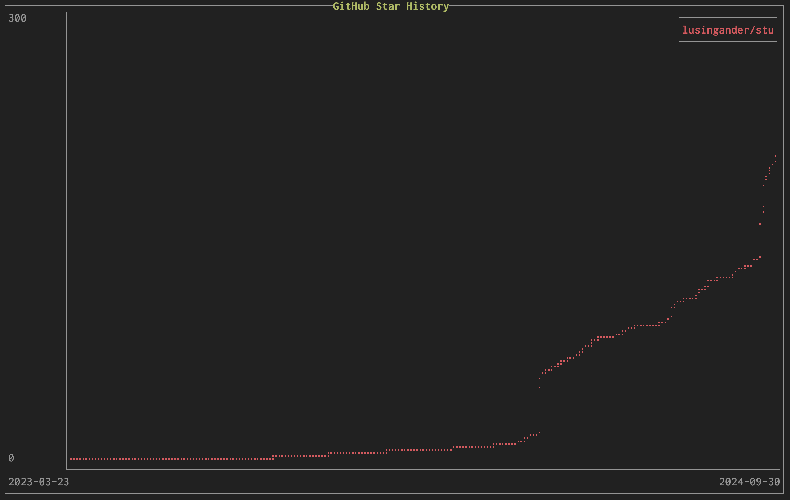

# ghsh

GitHub Star History TUI



## Prerequirements

You must set your GitHub access token via the `--token` or the `GHSH_ACCESS_TOKEN` environment variable.

> [!NOTE]
> You don't need to specify anything in the scope (only public information will be accessed).

## Usage

```
ghsh - GitHub Stars History TUI

Usage: ghsh [OPTIONS]

Options:
  -u, --user <NAME>        GitHub username
  -r, --repository <NAME>  GitHub repositories (multiple repositories can be specified)
                           Format: 'user/repo' or 'repo' if user is specified
  -t, --token <TOKEN>      GitHub access token
      --debug              Enable debug logging
  -h, --help               Print help
  -V, --version            Print version
```

> [!WARNING]
> If you specify only a user, multiple repositories, or a repository with a large number of stars, it may take a very long time or exceed the API request limit, resulting in an error.

## License

MIT
